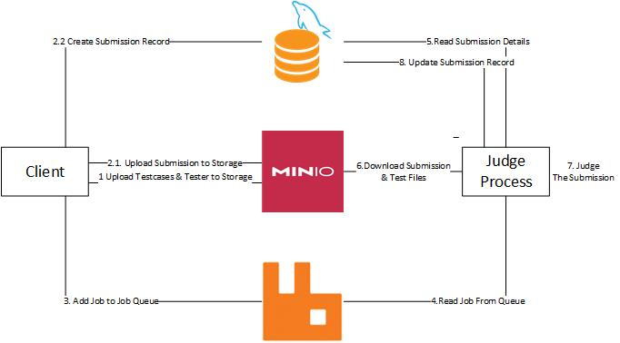

# Microservice Judge

[Jump to Instructions](#Instructions)

Want a sample client? [Check Here](https://github.com/amirmirzaei79/Micro-Service-Judge-Sample-Client)

Check out pre-built images on [Docker Hub](https://hub.docker.com/r/amirmirzaei79/microservice-judge).


## What is a Judge?

A judge is a program that compiles, executes, tests an input program against given testcases and gives it a score. The judge must also indicate if the code was failed to compile and also if it gave correct answer for a test, if the given answer was wrong or it an error occurred during test runtime. If you've seen a programming competition website, they are using a judge program.:wink: 


## Why Microservice?

Most judge programs (if you could call them a stand-alone program)  are intertwined with rest of the program that uses them. They are either functions or scripts that compile, execute and compare test results with truth values but they depend on another program to call them and give them input, they can not function on their own. As a result, this leads to a monolithic applications and websites; which makes them hard to maintain, debug and further develop and add new functionalities. More importantly such websites are practically very hard or even impossible to scale (up or down). Moving to a microservice architecture, while introducing some overhead, resolves these issues.


## About This Project

This project aims to separate the judge from rest of the logic; it depends on a database (MySQL) to store data, a remote storage (MinIO) to store files and a message broker (RabbitMQ) as a job queue. Each instance of judge interacts with these components independently of the others and is designed to be ephemeral. 

The program is containerized and each instance of judge runs in a separate container. It could be scaled up by simply spinning up more containers and scaled down by stopping those containers in any arbitrary order (it is suggested to use provided stop.sh script so if the instance is running a job, it could be returned to front of the job queue immediately and won't have to wait for it to be timed out)

Currently this project only supports C, C++, Python2 & Python3.


## Process




## Instructions

1. Spin up MySQL, RabbitMQ & MinIO

2. Spin up one or more judge instances (containers); provide following environmental variables for them:

   ```
   DB_HOST (Host address of database)
   DB_PORT (Port for database connection)
   DB_USER (database user (must have write access))
   DB_PASS (password for database user)
   DB_NAME (name of the database that is used)
   MINIO_HOST (Host address of MinIO)
   MINIO_PORT (Port for MinIO connection)
   MINIO_ACCESS_KEY (MinIO Access Key (username))
   MINIO_SECRET_KEY (MinIO Secret Key (password))
   MINIO_BUCKET (name of the MinIO bucket that is used)
   MQ_HOST (Host address of RabbitMQ)
   MQ_PORT (Port for RabbitMQ connection)
   MQ_USER (RabbitMQ user)
   MQ_PASS (password for RabbitMQ user)
   MQ_NAME (name of the queue that is used)
   ```

3. If testcases are not already uploaded to storage, upload testcases as explained [here](#Testcases Format). If you want to use a custom tester, upload that too as explained [here](#Custom Tester)

4. Do the following two steps in any arbitrary order (or in parallel)

   - Upload Submission to Storage
   - Create Submission record in database (Table must contain id (int), status (VARCHAR), results_path (VARCHAR), log_path (VARCHAR), score (float)) (id must set by client)

5. Add a record to job queue with this format (changes spaces with null char):

   ```
   Submission_File_Path Submission_Language Time_Limit(Secongs) Memory_Limit(KB) Testcases_Path Tester_Path Submission_Table_in_Database Submission_ID_in_Table
   ```

   If you want to use default tester (checks program output and output files to be exact), leave Tester_Path blank or write "Default" instead.

6. Wait for submission records status (in database table) change to something other than "In Queue" or "Testing"


## Testcases Format

Testcases must be a zip file containing two folders named "in" & "out". For each test there must be exactly one file inside "in" and one file inside "out" folder. files must be named "<test_number>.txt" starting from one and be continues; for example "1.txt", "2.txt" and so on.

For each file inside "in" folder, judge runs the input code, gives it the file as STDIN and stores the STDOUT of program. Afterwards judge gives input file, program produced output and corresponding file in "out" folder to tester program to check the results.

Default tester checks program output against desirable output and returns correct answer if they are the same.


## Custom Tester

Custom tester could be used to evaluate answers. A tester is an executable that takes input path, desired output path (corresponding file in "out" folder), and path to program (program in question) produced output and exits with exit code 0 if answer was correct or a different exit code if answer was incorrect. Output of tester (STDOUT & STDERR) will be reflected in log.txt file for submission.


## Details

### Why this architecture? What about ... ?

There are different ways to create such a program. This architecture was chosen to overcome the challenges of monolithic architecture. It would be best to describe each decision separately.

#### Why use a job queue? Why not to use direct API calls?

In summary, proper **Load Balancing**. Each job (evaluating each submission) could take a different time to complete therefore any proper load balancing approach must be aware of the state of each instance. Depending on the implementation judge instances might need a queue for themselves. Going for direct API calls either leads to uneven load balancing or requires another service which in addition to being very complex and hard to implement, introduces overhead on memory, CPU & network.

Using a job queue means judge instances can pull or wait for a new job whenever they finish their current one; no need for additional logic or queues.

#### Why not server-less (or similar approaches)? Why keep instances running?

Any server-less approach depends on a service provider that supports it. As the jobs for such a program could take up to minutes to complete, it is unlikely to find a public service provider that supports it. Also they typically limit some kernel calls that are necessary for sandboxing. It could also lead to security concerns as the judge requires some level of access to your storage and database.

Even if you execute the functions on your own infrastructure (such as running them as Kubernetes jobs or using Knative) , there is the issue of "cold start" and the overhead for creation and deletion of containers.

If you care for resource utilization, considering proper auto load balancing for this system could lead to better results.

#### Why RabbitMQ?

Although there are many alternatives, RabbitMQ provides great SDKs, is very stable and widely used and provides the required functionalities. Considering this project was designed to be a part of a larger system, using RabbitMQ seemed reasonable. 

#### Why a relational database? Why MySQL?

Considering the typical requirements of systems that could benefit from this project, it is more likely for them to use a relational database.

MySQL is the most commonly used open source relational DBMS and therefore was chosen for this project.

Nevertheless, it would be great to have support for other DBMSs and paradigms.

#### Why MinIO?

MinIO is very easy to set up and relatively easy to scale; specially compared to other types of remote storages. It also has good SDKs and is easy to work with.

Nevertheless, it would be great to have support for other types of remote storages.


### Sandboxing

[Bubblewrap](https://github.com/containers/bubblewrap) is used to provide sandboxing while compiling, running and testing programs. Currently version 0.6.1 (the version in Ubuntu 22.04 repositories) is used. Bubblewrap doesn't require root access to create sandbox and could be run as unprivileged user; which means if it breaks, the malicious code still only has user access.:sunglasses: Bubblewrap uses user namespaces in Linux kernel to create the sandbox (an approach similar to containers) instead of the common setuid approach which tends to be safer and prevents privilege escalation. Bubblewrap is also very fast and lightweight and doesn't add any considerable overhead.

Bubblewrap is used as a tool (installed inside the container) and this project doesn't include any code from that project.


## Future Work

- [ ] Adding support for more programming languages
- [ ] Finding better mechanism for setting time and memory limits
- [ ] Adding support for more DBMSs and database paradigms
- [ ] Adding support for more remote storages
- [ ] Reducing container size
- [ ] Improving Logging
- [ ] Adding Heartbeat 
- [ ] Adding Monitoring Metrics
- [ ] Adding Documentation


## Contribution

Contribution for all listed features or any new features are welcome. To contribute, please submit a pull request.
